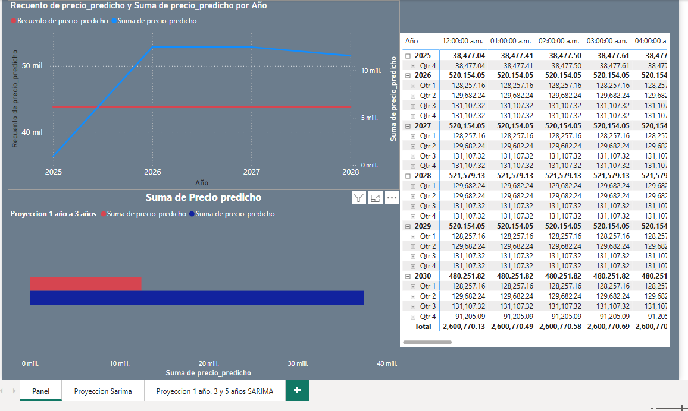
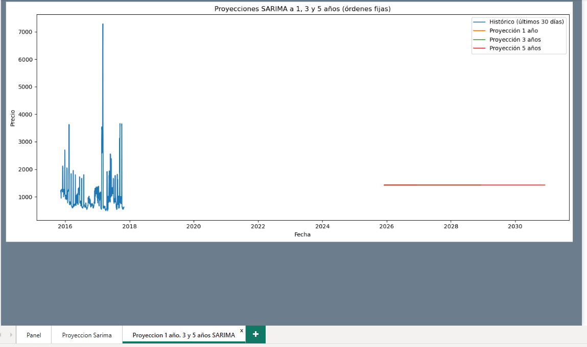
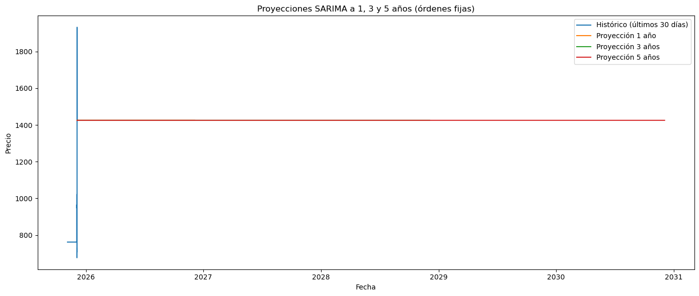
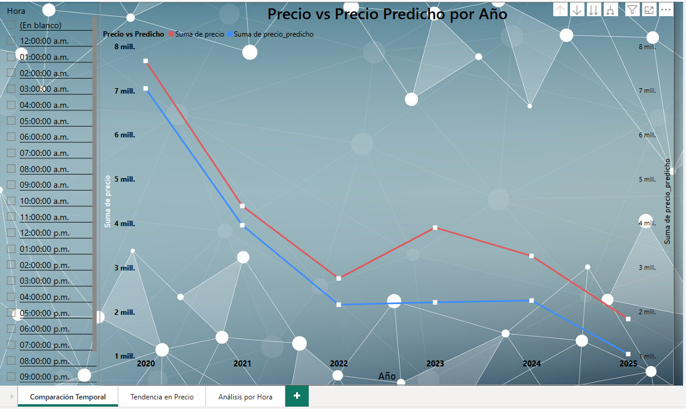
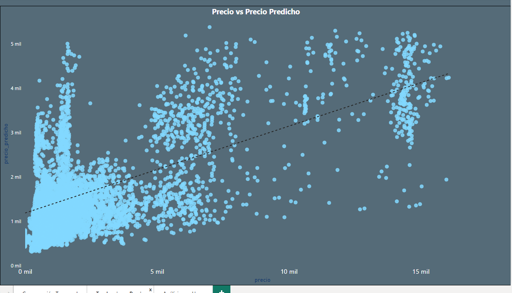
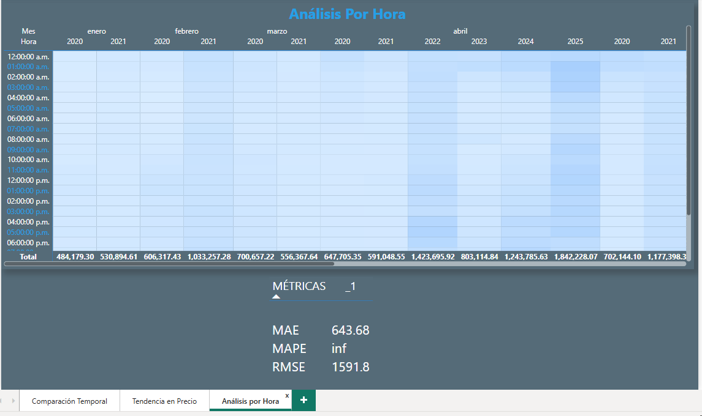
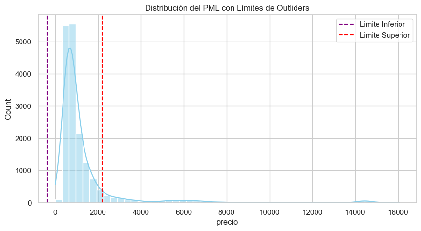

# 💻 Predicción del Precio Marginal Local (PML) en el Nodo CANCUN

Este proyecto tiene como objetivo predecir el Precio Marginal Local (PML) en el nodo distribuido CANCUN del Mercado de Energia de Corto Plazo (MECP) en México. Este análisis se realiza como parte de una prueba técnica para la vacante de Analista de Datos en Xiix Trading Solutions.

## 🎯 Objetivos

* Identificar tendencias históricas en el comportamiento del PML.
* Comprender los insumos y variables que lo componen (descripción simplificada).
* Generar un modelo de predicción diaria del PML horario (uno, dos y tres días).
* Generar un modelo de proyeccion anual del PML horario (uno, tres, y cinco años).

## 🏆 Entregables

* ***data/***: Directorio que contiene la base de datos consolidada 'PML_CANCUN_FINAL.csv' exportado del **'data_cleaning.py'**, asi como 'proyeccion_anual_sarima.csv' exportado de **'3_Proyeccion_Anual.ipynb'**

* ***descargas/***: Donde se encuentran todos los archivos CSV descargdos de la pagina *cenace.gob,mx*

* ***docs/***:
    *reporte_final.md:* Breve reporte con la descripcion de tendencias históricas, la explicación simplificada del PML, la metodología utilizada y los resultados de los modelos.

* ***images/***: Capturas de pantalla de DashBoards asi como imagenes PNG guardadas de las graficas representadas en EDA

* ***notebooks/***: Directorio con los notebook de Jupyter utilizados para el análisis y modelado:
    * '1_EDA_PML.ipynb': Notebook con el análisis exploratorio de datos.
    * '2_Prediccion_Diaria.ipynb': Notebook con el modelo de predicción diaria (Prophet)
    * '3_Proyeccion_Anual.ipynb': Notebook con el modelo de proyección anual (SARIMA).

* ***powerbi/***: Directorio donde se encuentran 2 Dashbords generados con los datos de 'Predicciones_con_metricas.csv' exportado de *'2_Prediccion_Diaria.ipynb'* y el otro generado con data 'proyeccion_anual_sarima.csv' exportado de *'3_Proyeccion_Anual.ipynb'* así como 'proyeccion_sarima_fijo_1_año.csv', 'proyeccion_sarima_fijo_3_años.csv' y 'proyeccion_sarima_fijo_5_años.csv'

* ***src/***: Directorio donde se encuentra archivo 'data_cleaning.py'

* ***README.md:*** Este archivo, con la descripcion del proyecto.

## ⌨ 🖥 Estructura del Código

* 'import.py': Script de Python donde se generaron la estructura de este proyecto con generacion de carpetas y archivos.

* 'data_cleaning.py': Script de Python utilizado para consolidar los archivos CSV de datos del PML

* '1_EDA_PML.ipynb': Notebook de Jupyter que contiene el análisis exploratorio de los datos del PML, incluyendo visualizaciones y resumen de estadisticas.

* '2_Prediccion_Diaria.ipynb': Notebook de Jupyter que implementa el modelo de predicción diaria utilizando la libreria Prophet.

* '3_Proyeccion_Anual.ipynb': Notebook de Jupyter que implementa el modelo de proyección anual utilizando la libreria SARIMA.

* El directorio 'descargas/' debe contener los archivos CSV originales del PML

* El directorio 'data' contendrá los archivos CSV generados con las predicciones

## 🛠 Cómo Ejecutar el Código

1. Clonar este repositorio.
2. ASegurate de tener instaladas las librerias necesarias (pandas, numpy, matplotlib, seaborn, prophet, scikit-learn, pmdarima, statsmodels). Puedes instalarlas con 'pip install pandas numpy matplotlib seaborn prophet pmdarima statsmodels'.
3. Colocar los archivos CSV originales del PML en el directorio 'descargas/'
4. Ejecutar los notebooks en el orden indicado: 'data_cleaning.py' (si es necesario generar el 'PML_CANCUN_FINAL.csv' incluso en variable zona_objetivo, pueden colocar ciudad que se quiera filtrar), luego '1_EDA_PML.ipynb', '2_Prediccion_diaria.ipynb' y finalmente '3_Proyeccion_Anual.ipynb'.
5. Los resultados de las predicciones se guardaran en el directorio 'data/' y 'notebooks'.
6. El reporte 'reporte_final.md contendrá el resumen del análisis y los resultados.

--- 
## 📸 Capturas de Pantalla de Dashboard Predicción Diaria

| Visualización | Descripción |
|---------------|-------------|
|   | Visión general de la tendencia del tiempo|
|   | Visualización de 1 3 y 5 años. |
|   | Grafica creada con ML con libreria Sarima |

---
## 📸 Capturas de Pantalla de Dashboard Proyeccion Anual

| Visualización | Descripción |
|---------------|-------------|
|   | Precio vs Precio Predicho por año |
|   | Grafico de dispersion por año |
|   | Mapa de Calor por hora  |
|  | Datos anomalos detectados |

---

## 🚀 Como abrir el proyecto

1. Instalar **Power BI Desktop** (descarga gratuita en [Microsoft Store](https://apps.microsoft.com/store/detail/power-bi-desktop/9NTXR16HNW1T)).
2. Clonar o descargar este repositorio.
3. Abrir los archivos `prediccion_diaria.pbix` y `proyeccion_anual.pbix` desde Power BI Desktop.

---
## 📃 Notas

* Este proyecto se enfoca en la predicción del PML en el nodo CANCUN, con un énfasis en el componente de congestión y precios (si se identificó y modeló).
* El modelo de proyeccion anual utiliza un modelo SARIMA para capturar la estacionalidad y las tendencias a largo plazo.

---

## 👨‍💻 Autor

***Alejandro Arellano***

## 📬 Contacto

- [LinkedIn](https://www.linkedin.com/in/alejandro-arellano-camacho/)  
- luis.alex.2711@gmail.com
